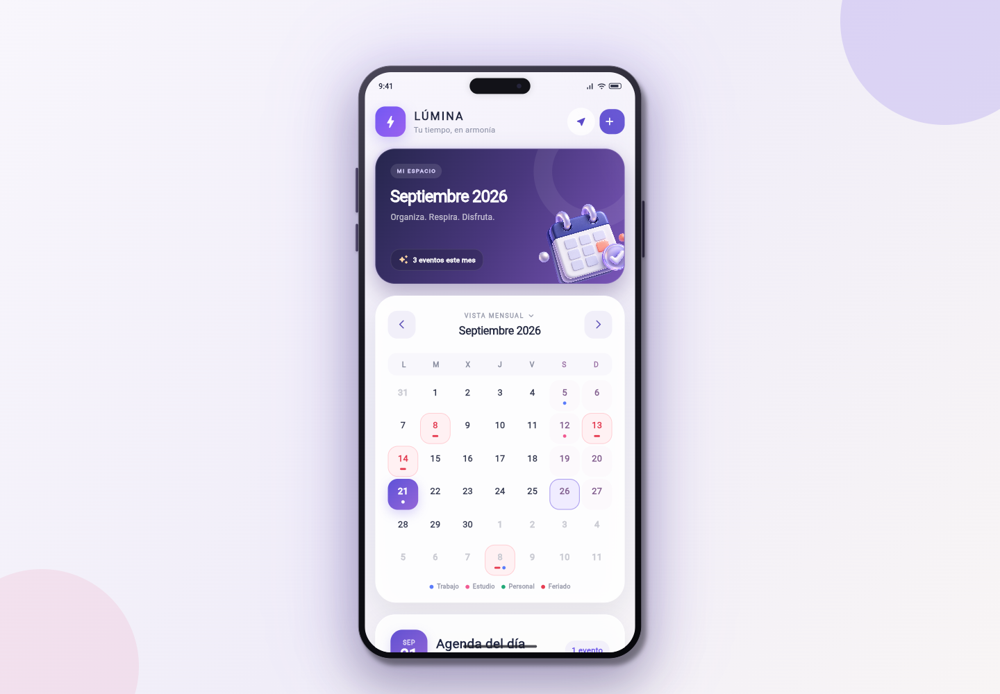

# Lab 06 · Calendario Lúmina

Aplicación de calendario desarrollada en Flutter con una interfaz móvil premium. Al ejecutarse en Chrome se presenta dentro de un mockup de teléfono con profundidad 3D, manteniendo el calendario y la agenda completamente interactivos.



## Funcionalidades

- Navegación entre meses y acceso directo al día actual.
- Selección de fechas y visualización de eventos por día.
- Indicadores de color para trabajo, estudio y actividades personales.
- Feriados nacionales y regionales de 2026 destacados en rojo, con detalle en la agenda.
- Creación de eventos con título, detalle, categoría y hora.
- Eliminación de eventos con opción para deshacer.
- Selector de fecha, estados hover y animaciones suaves.
- Diseño adaptable con presentación de smartphone en Flutter Web.
- Mockup realista con marco metálico, botones laterales, reflejo y animaciones de entrada.
- Ilustración 3D local, sin depender de recursos remotos.

## Tecnologías utilizadas

- Flutter y Dart.
- Material Design 3.
- Widgets propios y diseño responsivo con `LayoutBuilder`.
- Pruebas de widgets con `flutter_test`.
- Asset PNG transparente para la ilustración 3D del calendario.

El proyecto no necesita paquetes externos adicionales en tiempo de ejecución.

## Estructura principal

```text
lib/
├── main.dart
├── screens/
│   └── calendar_page.dart
└── widgets/
    ├── calendar_widget.dart
    └── event_card.dart

assets/
└── images/
    └── calendar_3d.png
```

## Ejecución

```bash
flutter pub get
flutter run -d chrome
```

## Validación

```bash
flutter analyze
flutter test
flutter build web --release
```

Las pruebas cubren navegación mensual, selección de eventos en formato móvil y creación de nuevos eventos.
